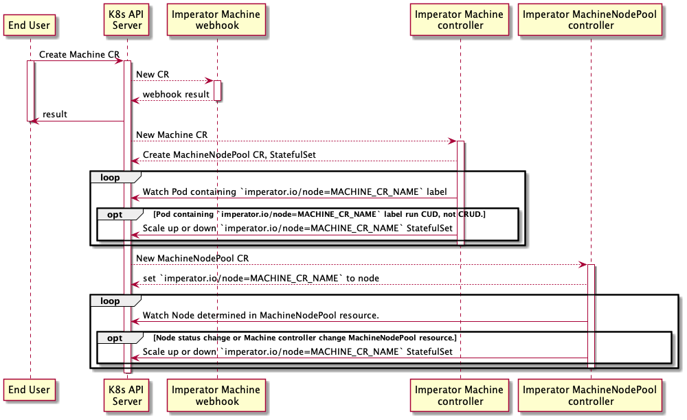

# imperator v1alpha
design document for imperator v1alpha1.

## Goal
Provide virtual resource group to applications.

## Overview

Imperator は Kubernetes Operator Pattern の controller で，2 つの controller が動作しています．

1. Machine Controller: 主に計算リソース確保のための StatefulSet の作成と，
`imperator.tenzen-y.io/machine` のラベルが付与されたゲスト Pod の数量管理を行います．

2. MachineNodePool controller: 各 MachineType にどの Node を割り当てるかの管理と Node の健康状態による使用可否を管理します．

3. Pod Resource Injector: Pod に machineType のラベルがついている Pod のコンテナに resource の指定を行います．

Note: v1alpha1 では 1 つの Node を複数の Machine グループに参加させることはできない．

## controller の設計
Machine CR の作成後， MachineLearning CR 作成後までのシーケンス図は以下のようになっている．



### Pod Resource Injector
`imperator.tenzen.io/inject-resource: enabled` のラベルがついた namespace のみ resource を注入する．
デフォルトでは，index が 0 のコンテナにリソースを注入するが，ラベルに `imperator.tenzen-y.io/inject-resource` があった場合そのコンテナに注入する．

### Machine controller

machine の数量管理では，Pod リソースを監視する．
- Pod label に `imperator.tenzen-y.io/machine` がついている物をスクレイプする．
  また，スクレイプしてきた中で 以下の条件に合致する物を稼働中としてカウントする．
    - Running: `.status.containerStatuses.state.Running` が nil ではない場合．
    - ContainerCreating: `.status.containerStatuses.state.waiting` が nil ではないかつ，
      `.status.containerStatuses.state.waiting.reason` が `Error` ではない場合．
    - Terminating: `.metadata.deletionTimestamp` が nil ではない場合．

作成される StatefulSet 及び Service は以下のような物になる．

```yaml
apiVersion: v1
kind: Service
metadata:
  name: compute-xlarge-general-machine # <Machine Type>-<Machine Group>
  labels:
    imperator.tenzen-y.io/machine-group: general-machine
    imperator.tenzen-y.io/machine-type: compute-xlarge
    imperator.tenzen-y.io/pod-role: reservation
spec:
  selector:
    imperator.tenzen-y.io/machine-group: general-machine
    imperator.tenzen-y.io/machine-type: compute-xlarge
    imperator.tenzen-y.io/pod-role: reservation
  type: ClusterIP
---
apiVersion: apps/v1
kind: StatefulSet
metadata:
  name: compute-xlarge-general-machine # <Machine Type>-<Machine Group>
  labels:
    imperator.tenzen-y.io/machine-group: general-machine
    imperator.tenzen-y.io/machine-type: compute-xlarge
    imperator.tenzen-y.io/pod-role: reservation
spec:
  selector:
    matchLabels:
      imperator.tenzen-y.io/machine-group: general-machine
      imperator.tenzen-y.io/machine-type: compute-xlarge
      imperator.tenzen-y.io/pod-role: reservation
  serviceName: compute-xlarge.general-machine # <Machine Type>.<Machine Group>
  replicas: 1
  template:
    metadata:
      labels:
        imperator.tenzen-y.io/machine-group: general-machine
        imperator.tenzen-y.io/machine-type: compute-xlarge
        imperator.tenzen-y.io/pod-role: reservation
    spec:
      tolerations:
        - key: imperator.tenzen-y.io/compute-xlarge
          effect: NoSchedule
          operator: Equal
          value: general-machine
        - key: imperator.tenzen-y.io/node-pool
          effect: NoSchedule
          operator: Equal
          value: ready
      affinity:
        nodeAffinity:
          requiredDuringSchedulingIgnoredDuringExecution:
            nodeSelectorTerms:
              - matchExpressions:
                  - key: imperator.tenzen-y.io/compute-xlarge
                    operator: In
                    values:
                      - general-machine
                  - key: imperator.tenzen-y.io/node-pool
                    operator: In
                    values:
                      - ready
                  - key: nvidia.com/gpu.family
                    operator: In
                    values:
                      - ampere
      containers:
      - name: sleeper
        image: alpine:3.15.0
        command: ["sleep"]
        args: ["infinity"]
        resources:
          requests:
            cpu: "40000m"
            memory: "128Gi"
            nvidia.com/gpu: "2"
          limits:
            cpu: "40000m"
            memory: "128Gi"
            nvidia.com/gpu: "2"
```

ゲスト Pod

```yaml
apiVersion: apps/v1
kind: Deployment
metadata:
  name: guest-deployment
  labels:
    imperator.tenzen-y.io/machine-group: general-machine
    imperator.tenzen-y.io/machine-type: compute-xlarge
    imperator.tenzen-y.io/pod-role: guest
    imperator.tenzen-y.io/injecting-container: training-container
spec:
  selector:
    matchLabels:
      imperator.tenzen-y.io/machine-group: general-machine
      imperator.tenzen-y.io/machine-type: compute-xlarge
      imperator.tenzen-y.io/pod-role: guest
  replicas: 1
  template:
    metadata:
      labels:
        imperator.tenzen-y.io/machine-group: general-machine
        imperator.tenzen-y.io/machine-type: compute-xlarge
        imperator.tenzen-y.io/pod-role: guest
    spec:
      tolerations:
        - key: imperator.tenzen-y.io/compute-xlarge
          effect: NoSchedule
          operator: Equal
          value: general-machine
        - key: imperator.tenzen-y.io/node-pool
          effect: NoSchedule
          operator: Equal
          value: ready
      affinity:
        nodeAffinity:
          requiredDuringSchedulingIgnoredDuringExecution:
            nodeSelectorTerms:
              - matchExpressions:
                  - key: imperator.tenzen-y.io/compute-xlarge
                    operator: In
                    values:
                      - general-machine
                  - key: imperator.tenzen-y.io/node-pool
                    operator: In
                    values:
                      - ready
                  - key: nvidia.com/gpu.family
                    operator: In
                    values:
                      - ampere
      containers:
        - name: training-container
          image: nvidia/cuda:11.4.2-devel-ubuntu20.04
          command: [ "sh", "-c" ]
          args: [ "python", "train.py" ]
          resources:
            requests:
              cpu: "40000m"
              memory: "128Gi"
              nvidia.com/gpu: "2"
            limits:
              cpu: "40000m"
              memory: "128Gi"
              nvidia.com/gpu: "2"
```

### NodePool controller
- Node の Annotation　に `imperator.tenzen-y.io/machine-group=グループ名` を付与する．
- nodePool の mode が ready のノードに `imperator.tenzen-y.io/nodePool=ready` のラベルをつける．
  nodePool に無いノードもしくは， mode が `ready` ではなくなったノードや status が `not-ready` では無くなったノードからはラベルを削除する．
- status の nodePool 欄 condition は，定期的に node を監視し，健康状態に応じて変更する．

## Custom Resource Schema

### Machine リソース

- spec.machineTypes[*].spec.hostLimit は，対象のマシン 1 つでホストリソースの何割まで消費することができるかの制限をつける．
- spec.machineTypes[*].spec.dependence は，親リソースを指定し，その親リソースの何割のリソースを使用するかを .availableRatio に記述する．

```yaml
---
apiVersion: imperator.tenzen-y.io/v1alpha1
kind: Machine
metadata:
  name: general-machine
  labels:
    imperator.tenzen-y.io/machine-group: general-machine
spec:
  nodePool:
    - name: michiru
      mode: ready
      taint: true # omitempty;default=false
      machineType:
        - name: compute-xlarge # Support only a machineType in first release
    - name: utaha
      mode: maintenance
      taint: false # omitempty;default=false
      machineType:
        - name: compute-medium # Support only a machineType in first release
    - name: eriri
      mode: ready
      taint: true # omitempty;default=false
      machineType:
        - name: compute-medium # Support only a machineType in first release
  machineTypes:
    - name: compute-medium
      spec:
        cpu: 6000m
        memory: 48Gi
        gpu: #omitempty
          type: nvidia.com/gpu
          num: 1
          machine: DGX-1
      available: 4
    - name: compute-xlarge
      spec:
        cpu: 40000m
        memory: 128Gi
        gpu: #omitempty
          type: nvidia.com/gpu # Support only GPUs made by Nvidia
          num: 2
          product: "NVIDIA-GeForce-RTX-3090"
      available: 1
    - name: compute-large
      spec:
        cpu: 20000m
        memory: 64Gi
        gpu: #omitempty
          type: nvidia.com/gpu
          num: 1
          family: ampere
      available: 2
status:
  conditions:
    - lastTransitionTime: "2021-07-24T09:08:39Z"
      status: "True"
      type: Ready
  availableMachines:
    - name: compute-medium
      usage:
        maximum: 4
        reserved: 3
        used: 1
        waiting: 0
    - name: compute-xlarge
      usage:
        maximum: 1
        reserved: 1
        used: 0
        waiting: 0
    - name: compute-large
      usage:
        maximum: 2
        reserved: 1
        used: 1
        waiting: 1
```

### MachineNodePool リソース

- .metadata.name は ownerReference を参照し，`.metadata.name-node-pool` にする．
- spec　は machine リソースから持ってくる．

```yaml
---
apiVersion: imperator.io/v1alpha1
kind: MachineNodePool
metadata:
  name: general-machine-node-pool
  labels:
    imperator.tenzen-y.io/machine-group: general-machine
spec:
  machineGroup: general-machine
  nodePool:
    - name: michiru
      mode: ready
      taint: true # omitempty;default=false
      machineType:
        - name: compute-xlarge # Support only one machineType in first release
    - name: utaha
      mode: maintenance
      taint: false # omitempty;default=false
      machineType:
        - name: compute-medium # Support only a machineType in first release
    - name: eriri
      mode: ready
      taint: true # omitempty;default=false
      machineType:
        - name: compute-medium # Support only a machineType in first release
  machineTypeStock:
    - name: compute-xlarge
    - name: compute-large
    - name: compute-medium
status:
  conditions:
    - lastTransitionTime: "2021-07-24T09:08:39Z"
      status: "True"
      type: Ready
  nodePool:
    - name: michiru
      condition: Ready
    - name: utaha
      condition: Maintenance
    - name: eriri
      condition: NotReady
```
