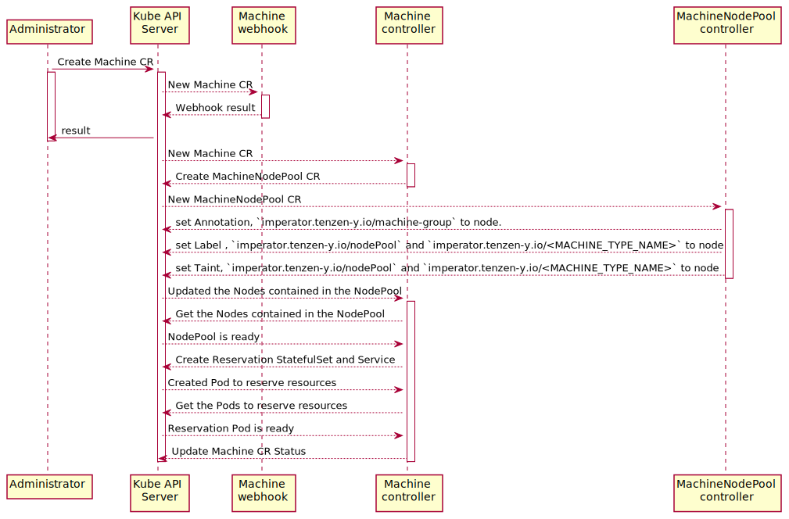
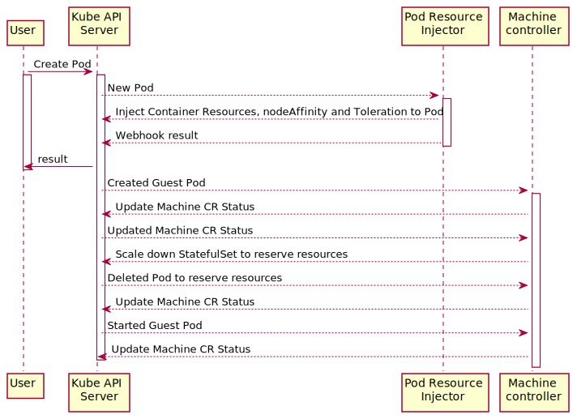

# imperator v1alpha
Design document for Imperator v1beta1.

## Goal
Provide virtual resource groups to applications.

## Overview

`Imperator` is the Kubernetes Operator that consists of three main components: `Machine Controller`, `MachineNodePool Controller` and `Pod Resource Injector`.

1. `Machine Controller` (Custom Controller):
   - Create `StatefulSets` and `Services` to reserve computer resources.
   - Manage the quantity of `Guest Pods` and `Reservation Pods`.
2. `MachineNodePool Controller` (Custom Controller):
    - Manage the health of `Nodes`. 
    - Set the `Labels`, `Annotations` and `Taints` of `MachineType`, etc. to Nodes defined in `NodePool`.
3. `Pod Resource Injector` (Admission Mutating Webhooks):
    - Inject `.spec.containers[*].resources`, `.spec.affinity.nodeAffinity` and `.spec.tolerations` to `Guest Pods` managed by `Imperator`.

Note: In `v1alpha1`, Node can not participate multiple machine-groups.

## Formats of Labels，Annotations，Taints and Toleration

- Labels

|                     Key                     | Description of Value  | Values                                           | Resources                                                                                                                         |
|:-------------------------------------------:|:---------------------:|:-------------------------------------------------|:----------------------------------------------------------------------------------------------------------------------------------|
|    `imperator.tenzen-y.io/machine-group`    | Name of Machine Group | <li> `general-machine` <li> et al.               | <li> Guest Pod <li> Machine CR <li> MachineNodePool CR <li> Reservation StatefulSet <li> Reservation Service <li> Reservation Pod |
|    `imperator.tenzen-y.io/machine-type`     | Name of Machine Type  | <li> `compute-xlarge` <li> et al.                | <li> Guest Pod <li> Node <li> Reservation StatefulSet <li> Reservation Service <li> Reservation Pod                               |
|      `imperator.tenzen-y.io/pod-role`       |       Pod Role        | <li> `reservation` <li> `guest`                  | <li> Guest Pod <li> Reservation StatefulSet <li> Reservation Service <li> Reservation Pod                                         |
|      `imperator.tenzen-y.io/nodePool`       |      Node Health      | <li> `ready` <li> `not-ready` <li> `maintenance` | <li> Node                                                                                                                         |
| `imperator.tenzen-y.io/<MACHINE_TYPE_NAME>` | Name of Machine Group | <li> `general-machine` <li> et al.               | <li> Node                                                                                                                         |

- Annotations

|                  Key                  | Description of Value  | Values                             | Resources |
|:-------------------------------------:|:---------------------:|:-----------------------------------|:----------|
| `imperator.tenzen-y.io/machine-group` | Name of Machine Group | <li> `general-machine` <li> et al. | <li> Node |

- Taints and Toleration

|                     Key                     | Description of Value  | Values                                           | Resources                                                                    |   Effect   |
|:-------------------------------------------:|:---------------------:|:-------------------------------------------------|:-----------------------------------------------------------------------------|:----------:|
|      `imperator.tenzen-y.io/nodePool`       |      Node Health      | <li> `ready` <li> `not-ready` <li> `maintenance` | <li> Node <li> Guest Pod <li> Reservation StatefulSet <li> Reservation Pod   | NoSchedule |
| `imperator.tenzen-y.io/<MACHINE_TYPE_NAME>` | Name of Machine Group | <li> `general-machine` <li> et al.               | <li> Node <li> Guest Pod <li> Reservation StatefulSet <li> Reservation Pod   | NoSchedule |

## Design for Custom Controller

- The Workflow of Administrators.



- The Workflow of Users.



### Machine Controller

- Create `StatefulSets` and `Services` to reserve computer resources.
- Manage the quantity of `Guest Pods` and `Reservation Pods`.

#### Conditions to be added to the Work Queue

1. Change of `Machine` CR.
2. Change of `MachineNodePool` CR.
3. Change of `StatefulSet` CR whose owner is `Machine`.
4. Change of `Guest Pod` or `Reservation Pod`.

#### Manage the quantity of `MachineType`

- States of `MachineType`
  - `Maximum`: The available maximum quantity of `MachineType` set in `Machine` CR.
  - `Reserved`: The number of running or creating `Reservation Pods`. 
  - `Used`: The number of running or creating `Guest Pods`.
  - `Waiting`: The number of "Guest Pods" that have not yet been scheduled to any Nodes.

- Conditions for each Pod states
  - `Running`:
    - There is not `.metdata.deletionTimestamp`.
    - `.status.phase` is `Running`.
    - `.status.Conditions[*]` has `{Type: "ContainersReady", Status: "True"}`.
  - `ContainerCreating`:
    - There is not `.metdata.deletionTimestamp`.
    - `.status.phase` is `Running`.
    - `.status.Conditions[*]` has `{Type: "ContainersReady", Status: "False"}`.
  - `Deleting`:
    - There is `.metdata.deletionTimestamp`.
  - `Unscheduled`:
     - There is not `.metdata.deletionTimestamp`.
    - `.status.phase` is `Pending`.
    - `.status.Conditions[*]` has `{Type: PodScheduled, "Status": "False"}`.
    - `.status.Conditions[*]` has `{Type: ContainersReady, "Status": "False"}`.
    - `spec.nodeName` is empty.

#### Machine CR

Note:
- Support only one `machineType` in `.spec.nodePool[*].machineType`.
- The default value is `false` in `.spec.nodePool[*].taint`.
- Support only GPUs made by Nvidia in `.spec.machineTypes[*].spec.gpu.type`.

```yaml
---
apiVersion: imperator.tenzen-y.io/v1alpha1
kind: Machine
metadata:
  name: general-machine
  labels:
    imperator.tenzen-y.io/machine-group: general-machine
spec:
  nodePool:
    - name: michiru
      mode: ready
      taint: true # omitempty;default=false
      machineType:
        - name: compute-xlarge # Support only one machineType in first release
    - name: utaha
      mode: maintenance
      taint: false # omitempty;default=false
      machineType:
        - name: compute-medium # Support only one machineType in first release
    - name: eriri
      mode: ready
      taint: true # omitempty;default=false
      machineType:
        - name: compute-medium # Support only one machineType in first release
  machineTypes:
    - name: compute-medium
      spec:
        cpu: 6000m
        memory: 48Gi
        gpu: #omitempty
          type: nvidia.com/gpu
          num: 1
          machine: DGX-1
      available: 4
    - name: compute-xlarge
      spec:
        cpu: 40000m
        memory: 128Gi
        gpu: #omitempty
          type: nvidia.com/gpu # Support only GPUs made by Nvidia
          num: 2
          product: "NVIDIA-GeForce-RTX-3090"
      available: 1
    - name: compute-large
      spec:
        cpu: 20000m
        memory: 64Gi
        gpu: #omitempty
          type: nvidia.com/gpu
          num: 1
          family: ampere
      available: 2
status:
  conditions:
    - lastTransitionTime: "2021-07-24T09:08:39Z"
      status: "True"
      type: Ready
  availableMachines:
    - name: compute-medium
      usage:
        maximum: 4
        reserved: 3
        used: 1
        waiting: 0
    - name: compute-xlarge
      usage:
        maximum: 1
        reserved: 1
        used: 0
        waiting: 0
    - name: compute-large
      usage:
        maximum: 2
        reserved: 1
        used: 1
        waiting: 1
```

#### Reservation StatefulSet and Service

Naming rule: <Machine Type>-<Machine Group>

```yaml
apiVersion: v1
kind: Service
metadata:
  name: compute-xlarge-general-machine # <Machine Type>-<Machine Group>
  labels:
    imperator.tenzen-y.io/machine-group: general-machine
    imperator.tenzen-y.io/machine-type: compute-xlarge
    imperator.tenzen-y.io/pod-role: reservation
spec:
  selector:
    imperator.tenzen-y.io/machine-group: general-machine
    imperator.tenzen-y.io/machine-type: compute-xlarge
    imperator.tenzen-y.io/pod-role: reservation
  type: ClusterIP
---
apiVersion: apps/v1
kind: StatefulSet
metadata:
  name: compute-xlarge-general-machine # <Machine Type>-<Machine Group>
  labels:
    imperator.tenzen-y.io/machine-group: general-machine
    imperator.tenzen-y.io/machine-type: compute-xlarge
    imperator.tenzen-y.io/pod-role: reservation
spec:
  selector:
    matchLabels:
      imperator.tenzen-y.io/machine-group: general-machine
      imperator.tenzen-y.io/machine-type: compute-xlarge
      imperator.tenzen-y.io/pod-role: reservation
  serviceName: compute-xlarge.general-machine # <Machine Type>-<Machine Group>
  replicas: 1
  template:
    metadata:
      labels:
        imperator.tenzen-y.io/machine-group: general-machine
        imperator.tenzen-y.io/machine-type: compute-xlarge
        imperator.tenzen-y.io/pod-role: reservation
    spec:
      tolerations:
        - key: imperator.tenzen-y.io/compute-xlarge
          effect: NoSchedule
          operator: Equal
          value: general-machine
        - key: imperator.tenzen-y.io/node-pool
          effect: NoSchedule
          operator: Equal
          value: ready
      affinity:
        nodeAffinity:
          requiredDuringSchedulingIgnoredDuringExecution:
            nodeSelectorTerms:
              - matchExpressions:
                  - key: imperator.tenzen-y.io/compute-xlarge
                    operator: In
                    values:
                      - general-machine
                  - key: imperator.tenzen-y.io/node-pool
                    operator: In
                    values:
                      - ready
                  - key: nvidia.com/gpu.family
                    operator: In
                    values:
                      - ampere
      containers:
      - name: sleeper
        image: alpine:3.15.0
        command: ["sleep"]
        args: ["infinity"]
        resources:
          requests:
            cpu: "40000m"
            memory: "128Gi"
            nvidia.com/gpu: "2"
          limits:
            cpu: "40000m"
            memory: "128Gi"
            nvidia.com/gpu: "2"
```

#### Guest Pod

- Essential Labels for `Guest Pod`
   - key: `imperator.tenzen-y.io/machine-group`
     value: `*`
     description: The name of machine-group to which the `machineType` to be used belongs. 
   - key: `imperator.tenzen-y.io/machine-type`
     value: `*`
     description: The name of `machineType`.
   - key: `imperator.tenzen-y.io/pod-role`
     value: `guest`
     description: Pod role.

- Option Labels for `Guest Pod`
   - key: `imperator.tenzen-y.io/injecting-container`
     value: `*`
     default: A container with index 0.
     description: The name of container into which users want to inject resources.

Note: If users do not create `Pod` directly, but indirectly using `Deployment` or something similar,
users must add labels to `spec.template.metadata`. 

```yaml
apiVersion: apps/v1
kind: Deployment
metadata:
  name: guest-deployment
spec:
  selector:
    matchLabels:
      imperator.tenzen-y.io/machine-group: general-machine
      imperator.tenzen-y.io/machine-type: compute-xlarge
      imperator.tenzen-y.io/pod-role: guest
      imperator.tenzen-y.io/injecting-container: training-container
  replicas: 1
  template:
    metadata:
      labels:
        imperator.tenzen-y.io/machine-group: general-machine
        imperator.tenzen-y.io/machine-type: compute-xlarge
        imperator.tenzen-y.io/pod-role: guest
        imperator.tenzen-y.io/injecting-container: training-container
    spec:
      containers:
        - name: training-container
          image: nvidia/cuda:11.4.2-devel-ubuntu20.04
          command: [ "sh", "-c" ]
          args: [ "python", "train.py" ]
```

### NodePool Controller

- Add `imperator.tenzen-y.io/machine-group=<MACHINE_GROUP_NAME>` to the Node Annotation.
- Add `imperator.tenzen-y.io/nodePool=ready` to Nodes whose `.spec.nodePool[*].mode` is `ready` in `.spec.nodePool[*]`.
- Remove labels from Nodes whose `.spec.nodePool[*].mode` is no longer `ready` or whose `.status.nodePool[*].condition` is `NotReady`.
- Monitor the Nodes in `.spec.nodePool` and update `.status.nodePool[*].condition` if the node status change.

#### Conditions to be added to Work Queue

1. Change of `MachineNodePool` CR
2. Change of Labels, Annotations and Taints for Nodes with `imperator.tenzen-y.io/machine-group=<MACHINE_GROUP_NAME>` as Annotations. 

#### Manage Conditions of Node

- Conditions for each Node State
  - `NotReady`:
    - Nodes have the following items as Taint.
      - `node.kubernetes.io/not-ready`
      - `node.kubernetes.io/unschedulable`
      - `node.kubernetes.io/network-unavailable`
      - `node.kubernetes.io/unreachable`
  - `Maintenance`:
    - `.spec.nodePool[*].mode` is `maintenance` in `MachineNodePool` CR.
  - `Ready`:
    - `Maintenance` is not met.
    - `NotReady` is not met.

#### MachineNodePool CR

Note:
- `.metdata.name` is `<OWENER_MACHINE_CR_NAME>-node-pool`.
- `.spec.nodePool` is a copy of `Machine` CR.

```yaml
---
apiVersion: imperator.io/v1alpha1
kind: MachineNodePool
metadata:
  name: general-machine-node-pool
  labels:
    imperator.tenzen-y.io/machine-group: general-machine
spec:
  machineGroup: general-machine
  nodePool:
    - name: michiru
      mode: ready
      taint: true # omitempty;default=false
      machineType:
        - name: compute-xlarge # Support only one machineType in first release
    - name: utaha
      mode: maintenance
      taint: false # omitempty;default=false
      machineType:
        - name: compute-medium # Support only one machineType in first release
    - name: eriri
      mode: ready
      taint: true # omitempty;default=false
      machineType:
        - name: compute-medium # Support only one machineType in first release
  machineTypeStock:
    - name: compute-xlarge
    - name: compute-large
    - name: compute-medium
status:
  conditions:
    - lastTransitionTime: "2021-07-24T09:08:39Z"
      status: "True"
      type: Ready
  nodePool:
    - name: michiru
      condition: Ready
    - name: utaha
      condition: Maintenance
    - name: eriri
      condition: NotReady
```

## Design for Admission Mutating Webhooks

### Pod Resource Injector

`Pod Resource Injector` injects `.spec.tolerations`, `.spec.affinity` and `.spec.containers[*].resources` 
for the `machineType` specified in Pod Labels into `Guest Pod`.  

Note:
- Inject resources only for Pods deployed in namespaces with the `imperator.tenzen.io/inject-resource: enabled` label.
- By default, inject resources to a container with index 0, although if users specified a container name in `imperator.tenzen-y.io/inject-resource` of Pod label, inject that container.

```yaml
apiVersion: v1
kind: Pod
metadata:
  name: guest-pod
  labels:
    imperator.tenzen-y.io/machine-group: general-machine
    imperator.tenzen-y.io/machine-type: compute-xlarge
    imperator.tenzen-y.io/pod-role: guest
    imperator.tenzen-y.io/injecting-container: guest-container
spec:
  tolerations:
    - key: imperator.tenzen-y.io/compute-xlarge
      effect: NoSchedule
      operator: Equal
      value: general-machine
    - key: imperator.tenzen-y.io/node-pool
      effect: NoSchedule
      operator: Equal
      value: ready
  affinity:
    nodeAffinity:
      requiredDuringSchedulingIgnoredDuringExecution:
        nodeSelectorTerms:
          - matchExpressions:
              - key: imperator.tenzen-y.io/compute-xlarge
                operator: In
                values:
                  - general-machine
              - key: imperator.tenzen-y.io/node-pool
                operator: In
                values:
                  - ready
              - key: nvidia.com/gpu.family
                operator: In
                values:
                  - ampere
  containers:
    - name: guest-container
      resources:
        requests:
          cpu: "40000m"
          memory: "128Gi"
          nvidia.com/gpu: "2"
        limits:
          cpu: "40000m"
          memory: "128Gi"
          nvidia.com/gpu: "2"
...
```
