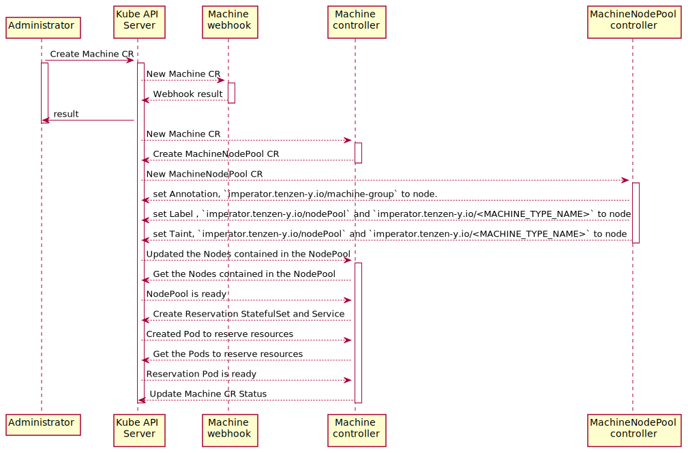

# imperator v1alpha1
Design document for Imperator v1alpha1 in Japanese.

## Motivation
仮想的なリソースグループをコンテナアプリケーションへ提供する．

## Overview

`Imperator` は `Machine Controller`，`MachineNodePool Controller`，`Pod Resource Injector` の 3 つの主要コンポーネントから構成された
Kubernetes Operator である．

1. `Machine Controller` (Custom Controller): 
   - 計算リソース予約のための StatefulSet および Service の作成する．
   - Guest Pod と Reservation Pod の数量管理を行う．

2. `MachineNodePool controller` (Custom Controller:
   - Node の健康状態による使用可否を管理する．
   - NodePool に定義された Node へ MachineType などの Label，Annotation，Taint をセットする．

3. `Pod Resource Injector` (Admission Mutating Webhooks):
   - Imperator 管理下の Guest Pod のコンテナへ `.spec.containers[*].resources`，`.spec.affinity.nodeAffinity`，`.spec.tolerations` を付与する．

Note: v1alpha1 では 1 つの Node を複数の Machine グループに参加させることはできない．

## Labels，Annotations，Taints，Toleration のフォーマット

- Labels

|                     Key                     | Description of Value  | Values                                           | Resources                                                                                                                         |
|:-------------------------------------------:|:---------------------:|:-------------------------------------------------|:----------------------------------------------------------------------------------------------------------------------------------|
|    `imperator.tenzen-y.io/machine-group`    | Name of Machine Group | <li> `general-machine` <li> et al.               | <li> Guest Pod <li> Machine CR <li> MachineNodePool CR <li> Reservation StatefulSet <li> Reservation Service <li> Reservation Pod |
|    `imperator.tenzen-y.io/machine-type`     | Name of Machine Type  | <li> `compute-xlarge` <li> et al.                | <li> Guest Pod <li> Node <li> Reservation StatefulSet <li> Reservation Service <li> Reservation Pod                               |
|      `imperator.tenzen-y.io/pod-role`       |       Pod Role        | <li> `reservation` <li> `guest`                  | <li> Guest Pod <li> Reservation StatefulSet <li> Reservation Service <li> Reservation Pod                                         |
|      `imperator.tenzen-y.io/nodePool`       |      Node Health      | <li> `ready` <li> `not-ready` <li> `maintenance` | <li> Node                                                                                                                         |
| `imperator.tenzen-y.io/<MACHINE_TYPE_NAME>` | Name of Machine Group | <li> `general-machine` <li> et al.               | <li> Node                                                                                                                         |

- Annotations

|                  Key                  | Description of Value  | Values                             | Resources |
|:-------------------------------------:|:---------------------:|:-----------------------------------|:----------|
| `imperator.tenzen-y.io/machine-group` | Name of Machine Group | <li> `general-machine` <li> et al. | <li> Node |

- Taints and Toleration

|                     Key                     | Description of Value  | Values                                           | Resources                                                                    |   Effect   |
|:-------------------------------------------:|:---------------------:|:-------------------------------------------------|:-----------------------------------------------------------------------------|:----------:|
|      `imperator.tenzen-y.io/nodePool`       |      Node Health      | <li> `ready` <li> `not-ready` <li> `maintenance` | <li> Node <li> Guest Pod <li> Reservation StatefulSet <li> Reservation Pod   | NoSchedule |
| `imperator.tenzen-y.io/<MACHINE_TYPE_NAME>` | Name of Machine Group | <li> `general-machine` <li> et al.               | <li> Node <li> Guest Pod <li> Reservation StatefulSet <li> Reservation Pod   | NoSchedule |

## Custom Controller の設計

- 管理者のワークフロー



- ユーザのワークフロー


### Machine Controller

- 計算リソース予約のための StatefulSet および Service の作成する．
- Guest Pod と Reservation Pod の数量管理を行う．

#### Work Queue への追加条件

1. Machine CR に変化があった時
2. MachineNodePool CR に変化があった時
3. Owner が Machine CR である StatefulSet に変化があった時
4. Guest Pod もしくは Reservation Pod に変化があった時

#### MachineType の数量管理

- 各 machineType には以下の 4 つの状態が存在する．
  - `Maximum`: Machine CR で設定された machineType の最大使用可能数 
  - `Reserved`: 実際に展開されて，Running または ContainerCreating である Reservation Pod の数
  - `Used`: 実際に展開されて，Running または ContainerCreating である Guest Pod の数
  - `Waiting`: まだ Node へスケージュールされていない Guest Pod の数

- Pod が各状態である条件
  - `Running`:
    - `.metadata.deletionTimestamp` が存在しない．
    - `.status.phase` が `Running`
    - `.status.Conditions[*]` に `{Type: "ContainersReady", Status: "True"}` がある．
  - `ContainerCreating`
    - `.metadata.deletionTimestamp` が存在しない．
    - `.status.phase` が `Running`
    - `.status.Conditions[*]` に `{Type: "ContainersReady", Status: "False"}` がある．
  - `Deleting`
    - `.metadata.deletionTimestamp` が存在する．
  - `UnScheduled`
    - `.metadata.deletionTimestamp` が存在しない．
    - `.status.phase` が `Pending`
    - `.status.Conditions[*]` に `{Type: PodScheduled, "Status": "False"}` がある．
    - `.status.Conditions[*]` に `{Type: ContainersReady, "Status": "False"}` がある．
    - `spec.nodeName` が空である．

#### Machine CR

Note:
- `.spec.nodePool[*].machineType` で複数の `machineType` はサポートしない．
- `.spec.nodePool[*].taint` はデフォルトで `false`
- `.spec.machineTypes[*].spec.gpu.type` は NVIDIA 製 GPU のみサポートする．

```yaml
---
apiVersion: imperator.tenzen-y.io/v1alpha1
kind: Machine
metadata:
  name: general-machine
  labels:
    imperator.tenzen-y.io/machine-group: general-machine
spec:
  nodePool:
    - name: michiru
      mode: ready
      taint: true # omitempty;default=false
      machineType:
        - name: compute-xlarge # Support only one machineType in first release
    - name: utaha
      mode: maintenance
      taint: false # omitempty;default=false
      machineType:
        - name: compute-medium # Support only one machineType in first release
    - name: eriri
      mode: ready
      taint: true # omitempty;default=false
      machineType:
        - name: compute-medium # Support only one machineType in first release
  machineTypes:
    - name: compute-medium
      spec:
        cpu: 6000m
        memory: 48Gi
        gpu: #omitempty
          type: nvidia.com/gpu
          num: 1
          machine: DGX-1
      available: 4
    - name: compute-xlarge
      spec:
        cpu: 40000m
        memory: 128Gi
        gpu: #omitempty
          type: nvidia.com/gpu # Support only GPUs made by Nvidia
          num: 2
          product: "NVIDIA-GeForce-RTX-3090"
      available: 1
    - name: compute-large
      spec:
        cpu: 20000m
        memory: 64Gi
        gpu: #omitempty
          type: nvidia.com/gpu
          num: 1
          family: ampere
      available: 2
status:
  conditions:
    - lastTransitionTime: "2021-07-24T09:08:39Z"
      status: "True"
      type: Ready
  availableMachines:
    - name: compute-medium
      usage:
        maximum: 4
        reserved: 3
        used: 1
        waiting: 0
    - name: compute-xlarge
      usage:
        maximum: 1
        reserved: 1
        used: 0
        waiting: 0
    - name: compute-large
      usage:
        maximum: 2
        reserved: 1
        used: 1
        waiting: 1
```

#### Reservation StatefulSet and Service

命名規則: <Machine Type>-<Machine Group>

```yaml
apiVersion: v1
kind: Service
metadata:
  name: compute-xlarge-general-machine # <Machine Type>-<Machine Group>
  labels:
    imperator.tenzen-y.io/machine-group: general-machine
    imperator.tenzen-y.io/machine-type: compute-xlarge
    imperator.tenzen-y.io/pod-role: reservation
spec:
  selector:
    imperator.tenzen-y.io/machine-group: general-machine
    imperator.tenzen-y.io/machine-type: compute-xlarge
    imperator.tenzen-y.io/pod-role: reservation
  type: ClusterIP
---
apiVersion: apps/v1
kind: StatefulSet
metadata:
  name: compute-xlarge-general-machine # <Machine Type>-<Machine Group>
  labels:
    imperator.tenzen-y.io/machine-group: general-machine
    imperator.tenzen-y.io/machine-type: compute-xlarge
    imperator.tenzen-y.io/pod-role: reservation
spec:
  selector:
    matchLabels:
      imperator.tenzen-y.io/machine-group: general-machine
      imperator.tenzen-y.io/machine-type: compute-xlarge
      imperator.tenzen-y.io/pod-role: reservation
  serviceName: compute-xlarge.general-machine # <Machine Type>-<Machine Group>
  replicas: 1
  template:
    metadata:
      labels:
        imperator.tenzen-y.io/machine-group: general-machine
        imperator.tenzen-y.io/machine-type: compute-xlarge
        imperator.tenzen-y.io/pod-role: reservation
    spec:
      tolerations:
        - key: imperator.tenzen-y.io/compute-xlarge
          effect: NoSchedule
          operator: Equal
          value: general-machine
        - key: imperator.tenzen-y.io/node-pool
          effect: NoSchedule
          operator: Equal
          value: ready
      affinity:
        nodeAffinity:
          requiredDuringSchedulingIgnoredDuringExecution:
            nodeSelectorTerms:
              - matchExpressions:
                  - key: imperator.tenzen-y.io/compute-xlarge
                    operator: In
                    values:
                      - general-machine
                  - key: imperator.tenzen-y.io/node-pool
                    operator: In
                    values:
                      - ready
                  - key: nvidia.com/gpu.family
                    operator: In
                    values:
                      - ampere
      containers:
      - name: sleeper
        image: alpine:3.15.0
        command: ["sleep"]
        args: ["infinity"]
        resources:
          requests:
            cpu: "40000m"
            memory: "128Gi"
            nvidia.com/gpu: "2"
          limits:
            cpu: "40000m"
            memory: "128Gi"
            nvidia.com/gpu: "2"
```

#### Guest Pod

- Guest Pod に必須のラベル
  - key: `imperator.tenzen-y.io/machine-group`  
    value: `*`  
    description: 使用する machineType が属している machine-group の名前
  - key: `imperator.tenzen-y.io/machine-type`  
    value: `*`  
    description: 使用する machineType の名前
  - key: `imperator.tenzen-y.io/pod-role`  
    value: `guest`  
    description: Pod の役割

- Guest Pod のオプションのラベル
  - key: `imperator.tenzen-y.io/injecting-container`  
    value: `*`  
    default: 0 個目のコンテナ  
    description: リソースを注入したいコンテナの名前
    
Note: Pod を直接作るのではなく，Deployment などを使って間接的に作る場合は，必ず `spec.template.metadata` にラベルをつける必要がある．
Deployment などの `.metadata.labels` につけても正常に動作しない．

```yaml
apiVersion: apps/v1
kind: Deployment
metadata:
  name: guest-deployment
spec:
  selector:
    matchLabels:
      imperator.tenzen-y.io/machine-group: general-machine
      imperator.tenzen-y.io/machine-type: compute-xlarge
      imperator.tenzen-y.io/pod-role: guest
      imperator.tenzen-y.io/injecting-container: training-container
  replicas: 1
  template:
    metadata:
      labels:
        imperator.tenzen-y.io/machine-group: general-machine
        imperator.tenzen-y.io/machine-type: compute-xlarge
        imperator.tenzen-y.io/pod-role: guest
        imperator.tenzen-y.io/injecting-container: training-container
    spec:
      containers:
        - name: training-container
          image: nvidia/cuda:11.4.2-devel-ubuntu20.04
          command: [ "sh", "-c" ]
          args: [ "python", "train.py" ]
```

### NodePool Controller

- Node の Annotation　に `imperator.tenzen-y.io/machine-group=<MACHINE_GROUP_NAME>` を付与する．
- nodePool の `.spec.nodePool[*].mode` が `ready` のノードに `imperator.tenzen-y.io/nodePool=ready` のラベルをつける．
- nodePool に無い Node もしくは，`.spec.nodePool[*].mode` が `ready` ではなくなったノードや `.status.nodePool[*].condition` が `NotReady` になったノードからはラベルを削除する．
- `.status.nodePool[*].condition` は，定期的に Node を監視し，健康状態に応じて変更する．

#### Work Queue への追加条件

1. MachineNodePool CR に変化があった時
2. Annotation に `imperator.tenzen-y.io/machine-group=<MACHINE_GROUP_NAME>` がついている Node で
Label，Annotation, Taint のいずれかが更新された時．

#### Node condition の管理

- 各 Node condition の条件
  - `NotReady`:
    - Taint に Key が以下の物が含まれている．
      - `node.kubernetes.io/not-ready`
      - `node.kubernetes.io/unschedulable`
      - `node.kubernetes.io/network-unavailable`
      - `node.kubernetes.io/unreachable`
  - `Maintenance`:
    - MachineNodePool CR の `.spec.nodePool[*].mode` で `maintenance` が設定されている．
  - `Ready`:
    - `Maintenance` の条件を満たさない．
    - `NotReady` の条件を満たさない．

#### MachineNodePool CR

Note:
- `.metadata.name` は`<OWNER_MACHINE_CR_NAME>-node-pool` にする．
- `.spec.nodePool`　は `Machine` CR から持ってくる．

```yaml
---
apiVersion: imperator.io/v1alpha1
kind: MachineNodePool
metadata:
  name: general-machine-node-pool
  labels:
    imperator.tenzen-y.io/machine-group: general-machine
spec:
  machineGroup: general-machine
  nodePool:
    - name: michiru
      mode: ready
      taint: true # omitempty;default=false
      machineType:
        - name: compute-xlarge # Support only one machineType in first release
    - name: utaha
      mode: maintenance
      taint: false # omitempty;default=false
      machineType:
        - name: compute-medium # Support only one machineType in first release
    - name: eriri
      mode: ready
      taint: true # omitempty;default=false
      machineType:
        - name: compute-medium # Support only one machineType in first release
  machineTypeStock:
    - name: compute-xlarge
    - name: compute-large
    - name: compute-medium
status:
  conditions:
    - lastTransitionTime: "2021-07-24T09:08:39Z"
      status: "True"
      type: Ready
  nodePool:
    - name: michiru
      condition: Ready
    - name: utaha
      condition: Maintenance
    - name: eriri
      condition: NotReady
```

## Admission Mutating Webhooks の設計

### Pod Resource Injector

Pod ラベルで指定された `machineType` に対応する物を Pod の `.spec.tolerations`，`.spec.affinity`，`.spec.containers[*].resources` へ注入する．  

Note:
- `imperator.tenzen.io/inject-resource: enabled` のラベルがついた namespace のみ resource を注入する．
- デフォルトでは，index が 0 のコンテナにリソースを注入するが，ラベルに `imperator.tenzen-y.io/inject-resource` があった場合そのコンテナに注入する．

```yaml
apiVersion: v1
kind: Pod
metadata:
  name: guest-pod
  labels:
    imperator.tenzen-y.io/machine-group: general-machine
    imperator.tenzen-y.io/machine-type: compute-xlarge
    imperator.tenzen-y.io/pod-role: guest
    imperator.tenzen-y.io/injecting-container: guest-container
spec:
  tolerations:
    - key: imperator.tenzen-y.io/compute-xlarge
      effect: NoSchedule
      operator: Equal
      value: general-machine
    - key: imperator.tenzen-y.io/node-pool
      effect: NoSchedule
      operator: Equal
      value: ready
  affinity:
    nodeAffinity:
      requiredDuringSchedulingIgnoredDuringExecution:
        nodeSelectorTerms:
          - matchExpressions:
              - key: imperator.tenzen-y.io/compute-xlarge
                operator: In
                values:
                  - general-machine
              - key: imperator.tenzen-y.io/node-pool
                operator: In
                values:
                  - ready
              - key: nvidia.com/gpu.family
                operator: In
                values:
                  - ampere
  containers:
    - name: guest-container
      resources:
        requests:
          cpu: "40000m"
          memory: "128Gi"
          nvidia.com/gpu: "2"
        limits:
          cpu: "40000m"
          memory: "128Gi"
          nvidia.com/gpu: "2"
...
```
